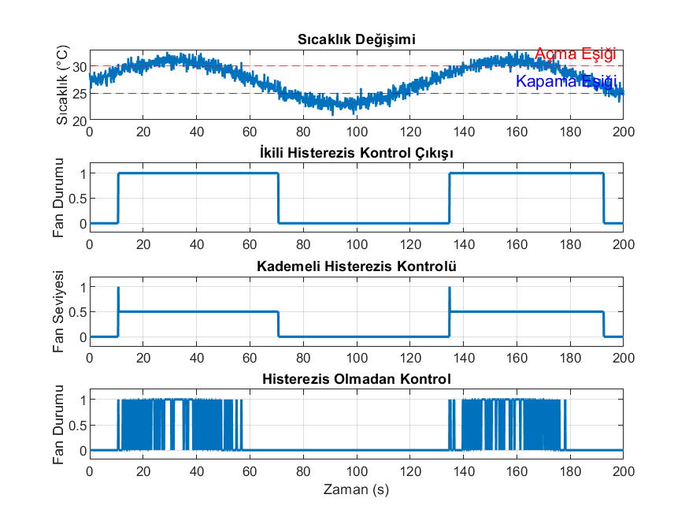

# Hysteresis Temperature Control (MATLAB)

This project simulates a temperature control system using hysteresis control in MATLAB.

## Project Description

A time-varying temperature signal with noise is generated to simulate a realistic environment.

Three different control approaches are analyzed:

- Binary hysteresis control
- Multi-level hysteresis control
- Control without hysteresis

## Results

Switching comparison:

- Without hysteresis: **282 switches**
- With hysteresis: **4 switches**

## Simulation Output

